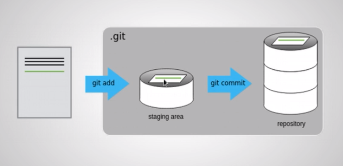

# Anotações sobre git - Comandos

git init nome_repositório -> Para criar repositório ou só git init se você já estiver na pasta.

--OFF topic: você dê um ls -la vocÊ vai conseguir ver uma pasta .git ( oculta ) isso dentro do seu repositório, normalmente essa pasta é 
utilizada para poder guardar as informações que o GIT vai precisar para você conseguir usar o ambiente.

git add -> adicionar arquivos que você precisa ou quer enviar

git add ./meu_arquivo.txt Ou git add . -> adiciona todos os arquivos que vc quer enviar de uma única vez

git status -> ele avisa se tem algo para vc submeter ou que esta esquecendo dentro do seu repositório

git log -> mostrará todos o histórico de commit com os seus respectivos HASH - autor e data.

git remove -v -> mostrará com qual repositório sua pasta está conectada.

git push -u origin main -> você seta o repositório que quer ficar sempre enviando os dados 

git diff -> diferença entre commits e branchs ( esse não faz nada pq é como se você tenta-se comparar seu estado atual com o estado atual).

git diff HEAD~1 -> vai comparar seu commit atual com o último commit que você fez ou seja -> HEAD - 1. 

git clone URL -> clona um repositório criado por alguém.

git pull -> baixa as alterações de um projeto.

git checkout <commit> <file> ->  você pode voltar seu arquivo para uma determinada parte do código baseado em um código anterior.

git checkout main -> você pode usar isso para sair do modo detached e voltar para branch original.

# Estados dos arquivos no GIT

Quando vocÊ cria -> não monitorado ( untracked )
Quando você mexe nele -> modificado ( modified )
Qunado você adiciona ele (add) -> preparado ( staged )
Quando você commita o que fez -> consolidado ( commited ) 

